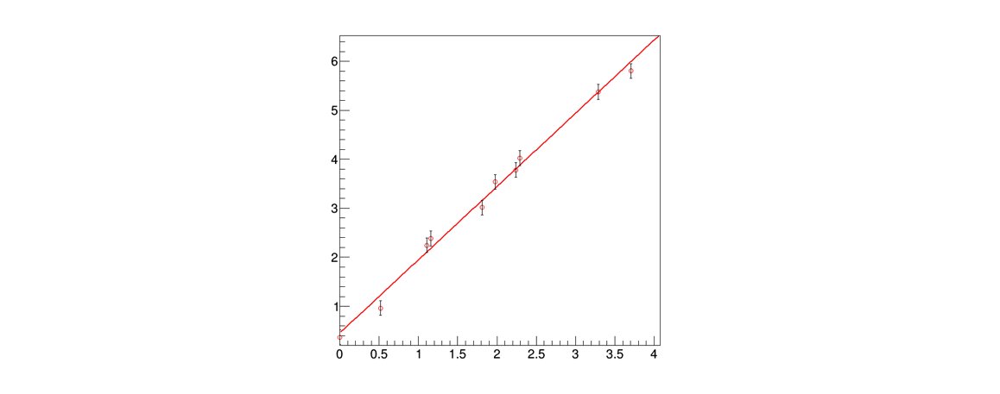

# Lezione 11: il metodo dei minimi quadrati in ```ROOT```

## Indice

  * [11.1 Introduzione](#111-introduzione)
    * [11.1.1 Un esempio immediato](#1111-un-esempio-immediato)
    * [11.1.2 Il caso *y=&phi;(x)*](#1112-il-caso-yphix)
    * [11.1.3 La determinazione dei parametri &theta;](#1113-la-determinazione-dei-parametri-theta)
    * [11.1.4 Le proprietà del metodo](#1114-le-proprietà-del-metodo)
    * [11.1.5 Il caso lineare](#1115-il-caso-lineare)
  * [11.2 Un esercizio di regressione](#112-un-esercizio-di-regressione)
    * [11.2.1 Come rappresentare in ```ROOT``` i dati](#1121-come-rappresentare-in-root-i-dati)
    * [11.2.2 La rappresentazione della funzione modello](#1122-la-rappresentazione-della-funzione-modello)
    * [11.2.3 La determinazione dei parametri](#1123-la-determinazione-dei-parametri)
  * [11.3 L'analisi del risultato della regressione](#113-lanalisi-del-risultato-della-regressione)
    * [11.3.1 La stampa a schermo del risultato](#1131-la-stampa-a-schermo-del-risultato)
    * [11.3.2 La convergenza del fit](#1132-la-convergenza-del-fit)
    * [11.3.3 Il valore dei parametri e la loro incertezza](#1133-il-valore-dei-parametri-e-la-loro-incertezza)
    * [11.3.4 La matrice di covarianza dei parametri risultanti](#1134-la-matrice-di-covarianza-dei-parametri-risultanti)
  * [11.4 la sigma delle misure ed il metodo dei minimi quadrati](#114-la-sigma-delle-misure-ed-il-metodo-dei-minimi-quadrati)
  * [11.5 ESERCIZI](#116-esercizi)

## 11.1 Introduzione

  * Il metodo dei **minimi quadrati** si basa su un principio indipendente
    rispetto a quello della massima verosimiglianza
  * Si scelgono i parametri &theta; che rendono **minima la distanza** 
    fra il modello ed i dati, 
    secondo una metrica definita dagli scarti quadratici medi


### 11.1.1 Un esempio immediato

  * Per determinare la media &mu; di un insieme di misure *x<sub>i</sub>*
    si può minimizzare la funzione:


### 11.1.2 Il caso *y=&phi;(x)*

  * La stessa metrica viene spesso utilizzata
    per fare **regressioni sui dati**, chiamata anche *fit*
  * Siano date *N* coppie di misure indipendenti del tipo *(x<sub>i</sub>, y<sub>i</sub> )*,
    per le quali:
    * l'incertezza sul valore *x<sub>i</sub>* sia **nulla o trascuarbile**
    * **l'incertezza sul valore *y<sub>i</sub>*** sia &sigma;<sub>i</sub>
  * Sia data l'ipotesi che le due variabili *x<sub>i</sub>* e *y<sub>i</sub>*
    siano in **relazione fra loro secondo una funzione *&phi;*** tale per cui *y=&phi;(x,&theta;)*
  * Si definisce la **funzione *Q<sup>2</sup>(&theta;)*** come:


### 11.1.3 La determinazione dei parametri &theta;

  * In questo caso, i parametri &theta; (&theta; può essere un vettore)
    si determinano **trovando il minimo della funzione *Q(&theta;)***:

  * esistono diverse tecniche numeriche per trovare il minimo della funzione


### 11.1.4 Le proprietà del metodo

  * Se gli scarti *&epsilon;<sub>i</sub>* di *y<sub>i</sub>* rispetto a *&phi;(x<sub>i</sub>,&theta;)*
    hanno **valore di aspettazione nullo e varianza finita e fissa**,
    cioè non dipendente da *y*, allora 
    * il metodo dei minimi quadrati è uno **stimatore non distorto** dei parametri &theta;
    * ed ha la **varianza minima** fra tutti gli stimatori non distorti lineari (in *y*), 
      indipendentemente dalla distribuzione di probabilità degli scarti
  * Se gli scarti *&epsilon;<sub>i</sub>* sono distribuiti secondo una distribuzione di probabilità Gaussiana,
    il minimo della funzione *Q<sup>2</sup>(&theta;)*
    è distribuito secondo una **distribuzione di probabilià &Chi;<sup>2</sup>**
    con *N-k* gradi di libertà,
    * dove *N* è il **numero di coppie** *(x<sub>i</sub>, y<sub>i</sub> )*
      e *k* il **numero di parametri stimati** con i minimi quadrati


### 11.1.5 Il caso lineare

  * Nel caso in cui la funzione *g(x)* sia **lineare nei parametri &theta;**,
    le equazioni di minimizzazione possono essere risolte analiticamente

  * Un esempio di funzione lineare è **la retta 
    *&phi;(x,&theta;) = &theta;<sub>1</sub> + &theta;<sub>2</sub> x***:
    * *h<sub>1</sub>(x) = 1*
    * *h<sub>2</sub>(x) = x*
  * Un altro esempio di funzione lineare è **una parabola 
    *&phi;(x,&theta;) = &theta;<sub>1</sub> + &theta;<sub>2</sub> x + &theta;<sub>3</sub> x<sup>2</sup>***:
    * *h<sub>1</sub>(x) = 1*
    * *h<sub>2</sub>(x) = x*
    * *h<sub>3</sub>(x) = x<sup>2</sup>*


## 11.2 Un esercizio di regressione

  * Utilizzando la generazione di numeri pseudo-casuali,
    si può **simulare la raccolta di N misure indipendenti *(x<sub>i</sub>, y<sub>i</sub>)***
    a partire da un modello iniziale *y=&phi;(x, &theta;)*,
    ad esempio:
    ```cpp
    double retta (double * x, double * par)
      {
        return par[0] + par[1] * x[0] ;
      }
    ```
  * La generazione di numeri pseudo-casuali
    sarà utilizzata per **distribuire in modo casuale i punti lungo l'asse *x***
    e per **trovare i valori dei termini &epsilon;<sub>i</sub>**


### 11.2.1 Come rappresentare in ```ROOT``` i dati

  * ```ROOT``` fornisce strumenti che **applichino automaticamente
    il metodo dei minimi quadrati** per trovare i paremetri
    (in gergo tecnico, *fare un fit*)
  * Coppie di misure come quelle generate sono solitamente rappresentate
    sotto forma di [```TGraphErrors```](https://root.cern.ch/doc/master/classTGraphErrors.html) in ROOT:
    ```cpp
    vector<double> v_x ;  // coordinate x
    vector<double> v_y ;  // coordinate y
    vector<double> v_ex ; // errore sulle coordinate x
    vector<double> v_ey ; // errore sulle coordinate y
    //...
    TGraphErrors g_retta (v_x.size (), &v_x[0], &v_y[0], &v_ex[0], &v_ey[0]) ;
    ```


### 11.2.2 La rappresentazione della funzione modello

  * Per rappresentare la funzione modello, 
    si utilizza un **oggetto della classe ```TF1```**:
    ```cpp
    TF1 f_fit ("f_fit", retta, 0., 20., 2) ;
    ```
  * La ```TF1``` è definita a partire dalla funzione di ```C++``` chiamata ```retta```;
  * è definita sull'intervallo ```(0., 20.)```
  * ed ha 2 parametri liberi


### 11.2.3 La determinazione dei parametri

  * L'**operazione di fit** viene effettuata con il seguente comando,
    che invoca il metodo dei **minimi quadrati**:
    ```cpp
    TFitResultPtr fit_result = g_retta.Fit (&f_fit, "S") ;
    ```
  * Dopo il fit,
    la funzione con nome ```"f_fit"``` ha i propri **parametri adattati all'istogramma**
  * L'opzione ```"S"``` garantisce che il **risultato del fit venga salvato**
    e sia accessibile tramite l'oggetto ```fit_result``` di tipo ```TFitResultPtr```
  * La funzione ```TF1``` viene **automaticamente associata al ```TGraph```**
    e disegnata insieme su un ```TCanvas```, 
    se il metodo ```TGraph::Draw``` viene chiamato dopo il fit  


## 11.3 L'analisi del risultato della regressione

  * La funzione di fit viene automaticamente aggiunta alla proprietà del ```TGraph```
    e visualizzata quando viene invocato il metodo ```TGraph::Draw```:




### 11.3.1 La stampa a schermo del risultato

  * L'**output a schermo** del fit ha la forma seguente:
    ```
    FCN=10.2772 FROM MIGRAD    STATUS=CONVERGED      31 CALLS          32 TOTAL
                        EDM=2.82836e-21    STRATEGY= 1      ERROR MATRIX ACCURATE 
     EXT PARAMETER                                   STEP         FIRST   
     NO.   NAME      VALUE            ERROR          SIZE      DERIVATIVE 
      1  p0           4.44872e-01   9.13398e-02   7.77790e-05  -5.70963e-10
      2  p1           1.49520e+00   4.31502e-02   3.67439e-05  -2.65893e-09
    ```
    * In questo caso, l'algoritmo di minimizzazione utilizzato è ```MIGRAD```
    * L'algoritmo ha avuto successo: ```STATUS=CONVERGED```
    * I **valori dei singoli parametri** e della loro incertezza sono riportati a schermo
  * Le **singole informazioni** si possono recuperare anche dentro il codice sorgente  


### 11.3.2 La convergenza del fit

  * Per conoscere il **successo dell'algoritmo numerico**,
    si utilizza il metodo ```TFitResult::IsValid ()```, che deve essere ```true``` in caso di successo,
    oppure il metodo ```TFitResult::Status ()```, che deve essere ```0``` in caso di successo
    ```cpp
    cout << "primo feedback sul risultato del fit: " << fit_result->IsValid () << endl ;
    cout << "primo feedback sul risultato del fit: " << fit_result->Status () << endl ;
    ```
    * La classe ```TFitResultPtr``` si comporta come un puntatore ad oggetti di tipo ```TFitResult```


### 11.3.3 Il valore dei parametri e la loro incertezza

  * Il valore dei parametri e della loro incertezza possono essere **ottenuti dalla funzione di fit**:
    ```cpp
    cout << "termine noto : " << f_fit.GetParameter (0) << "\t+- " << f_fit.GetParError (0) << endl ;
    cout << "pendenza     : " << f_fit.GetParameter (1) << "\t+- " << f_fit.GetParError (1) << endl ;
    ```


### 11.3.4 La matrice di covarianza dei parametri risultanti

  * La matrice di covarianza e di correlazione dei parametri risultati **può essere stampata a schermo**:
    ```cpp
    fit_result->PrintCovMatrix (cout) ;
    ```
  * I **singoli valori** sono accessibili tramite un oggetto di tipo ```TMatrixDSym``` (una matrice simmetrica),
    che si ottiene sempre dall'oggetto ```fit_result```:
    ```cpp
    TMatrixDSym cov = fit_result->GetCovarianceMatrix () ;
    for (int i = 0; i < cov.GetNrows () ; ++i)
      {
        for (int j = 0; j < cov.GetNcols () ; ++j)
          {
            cout << cov(i,j) << "\t" ;
          }
        cout << "\n";
      }
    ```
  * In alternativa, 
    si può **accedere direttamente ai singoli elementi** della matrice di covarianza
    con il metodo ```TFitResult::CovMatrix```:
    ```cpp
    cout << "\nmatrice di covarianza del risultato\n\n:" ;
    cout << "\t " << fit_result->CovMatrix (0,0) ;
    cout << "\t " << fit_result->CovMatrix (1,0) << "\n" ;
    cout << "\t " << fit_result->CovMatrix (0,1) ;
    cout << "\t " << fit_result->CovMatrix (1,1) << "\n" ; 
    ```

## 11.4 la sigma delle misure ed il metodo dei minimi quadrati

  * Nel caso in cui le variabili casuali &epsilon;<sub>i</sub> abbiano distribuzione
    di densità di probabilità Gaussiana,
    **il valore del Q<sup>2</sup> associato al fit
    è distribuito secondo una distribuzione del &chi;<sup>2</sup>**
    con un numero di gradi di libertà pari 
    al numero di gradi di libertà del fit
     * il numero di gradi di libertà del fit è uguale al **numero di punti meno il numero di parametri stimati**
  * Questa proprietà del metodo dei minimi quadrati permette,
    assumendo che le variabili casuali &epsilon;<sub>i</sub> siano gaussiane,
    di stimare le incertezze sui valori *y<sub>i</sub>*


## 11.5 ESERCIZI

  * Gli esercizi relativi alla lezione si trovano [qui](ESERCIZI.md)
